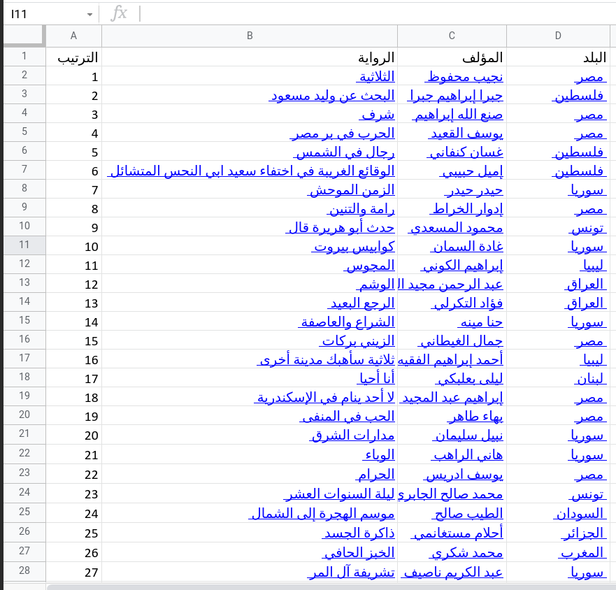

# Generate_pdfs

This program get data from excel sheet that have data about books and generate books covers for each book

## Code-Dependencies

All Dependencies in requirements.txt file to install all of them using pip just

1. go to the directory where script and requirements.txt is located.
2. activate your virtualenv.
3. run in `pip install -r requirements.txt` in your shell.
4. you must download one of free Arabic fonts `.ttf` like : [arabic.ttf](https://github.com/mohamdhashim/Generate_pdfs/blob/main/arabic.ttf) in files

## Input Excel Sheet

## Output Folder with covers

Each cover has a clickable QR code linked with the Wikipedia page of a book

